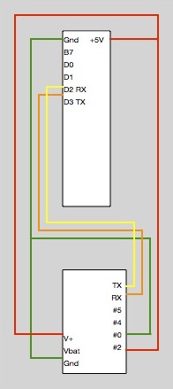

# Mac2Teensy2Huzzah
This is a method for using a Teensy 2.0++ as a serial bridge so that an Adafruit Huzzah can be programmed from the Arduino IDE on Mac OS X 10.11.

First, load the Mac2Teensy2HuzzahSerialBridge sketch onto the Teensy.  Then, unplug the USB cable from the Mac and connect the Teensy and Huzzah as follows:

Connect V+ and Gnd as well as the serial RX/TX pins.  Note that the RX of the Teensy is connected to TX of the Huzzah and vice-versa.

In addition, the Huzzah's GPIO0 pin should be connected to ground and the GPIO2 pin to +V in order to force the Huzzah into programming mode when it is powered on.  Here is the complete setup ready for the USB cable to be plugged into the Mac.

* Load the Mac2Teensy2Huzzah.ino sketch onto the Teensy.
* Unplug the USB cable and connect the Teensy to the Huzzah as shown.
* Switch to your sketch that you want to load on the Huzzah
* (don't forget to change to Tools->Board: "Adafruit HUZZAH ESP8266".  The Teensy's serial port should still be selected in Tools->Port).
* lug the USB cable into the Mac and click "Upload".
* After the sketch compiles, you should see the Teensy's LED light up as the program is uploaded to the Huzzah's flash.
* Once the upload is complete, be sure to disconnect GPIO0 from ground and GPIO2 from V+.
